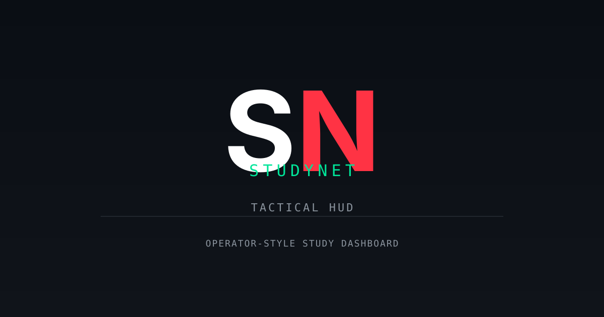

# StudyNet



Operator-style study dashboard built with React 19, Vite, TypeScript, Tailwind CSS v4, Supabase, and Express.

## Screens

- Home
- Schedule
- AI-Net
- Decks
- Stats
- Drill

## Tech Stack

- Frontend: React 19, Vite, TypeScript, Tailwind CSS v4
- Backend: Express (AI/API routes)
- Database: Supabase (PostgreSQL + Row Level Security)
- AI: Google Gemini API

## Prerequisites

- Node.js
- Supabase project
- Gemini API key (optional, for AI features)

## Setup

1. Install dependencies:
   ```bash
   npm install
   ```

2. Copy `.env.example` to `.env` and fill in values:
   ```bash
   cp .env.example .env
   ```

   Required variables:
   - `VITE_SUPABASE_URL` - Your Supabase project URL
   - `VITE_SUPABASE_PUBLISHABLE_KEY` - Your Supabase publishable key
   - `GEMINI_API_KEY` - Your Google Gemini API key (required for AI-Net)

3. Set up the Supabase database:
   - Open Supabase SQL Editor
   - Run `supabase/schema.sql`
   - Run `supabase/seed.sql`

4. Start the dev server:
   ```bash
   npm run dev
   ```

The app will be available at `http://localhost:3000`.

## Database Schema

All data lives in Supabase. The schema is defined in `supabase/schema.sql` and includes tables for operator profiles, subjects, alerts, schedule days/items, flashcards, drill questions, CGPA history, radar attributes, chat messages, and exam countdowns. Row Level Security is enabled with public access policies for local development.

## Scripts

- `npm run dev` - Start development server (Express + Vite)
- `npm run build` - Build for production
- `npm run start` - Start production server
- `npm run preview` - Preview production build
- `npm run lint` - Run TypeScript type checking
